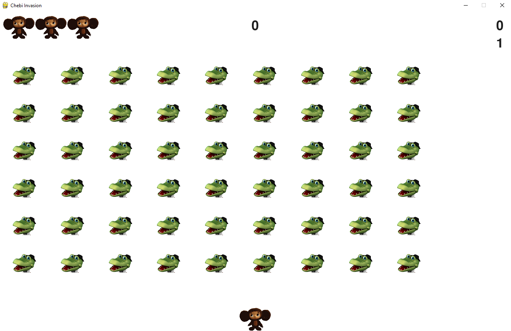

# Chebi Invasion
<div align=center margin= auto> 
  
</div>

# Chebi Invasion
Chebi invasion is a clone of popular arcade game with same name.
I created this game by following the "Python Crash Course" book. 
The reason was to improve my python skills.

# Introduction
In Chebi Invasion, a cheburashka is present at the bottom of the screen, which can be controlled using arrow keys and spacebar.
- Right Arrow : Spaceship moves to the right.
- Left Arrow  : Spaceship moves to the left.
- Spacebar    : Spaceship shoots oranges.

Objective of the game is stop the fleet of crocodiles gena from reachng the bottom of the screen and our spaceship, if any of these happens then the player loses the cheburashka. In the game player have three extra cheburashkas.

# Requeriments
- [Python](https://www.python.org/) 3.x +
- [Pygame](https://www.pygame.org/)

# Cloning the Repository

$ git clone https://github.com/Latarho/Chebi_Invasion.git

$ cd Alien-Invasion

# Running 

```
$ python alien_invasion.py
